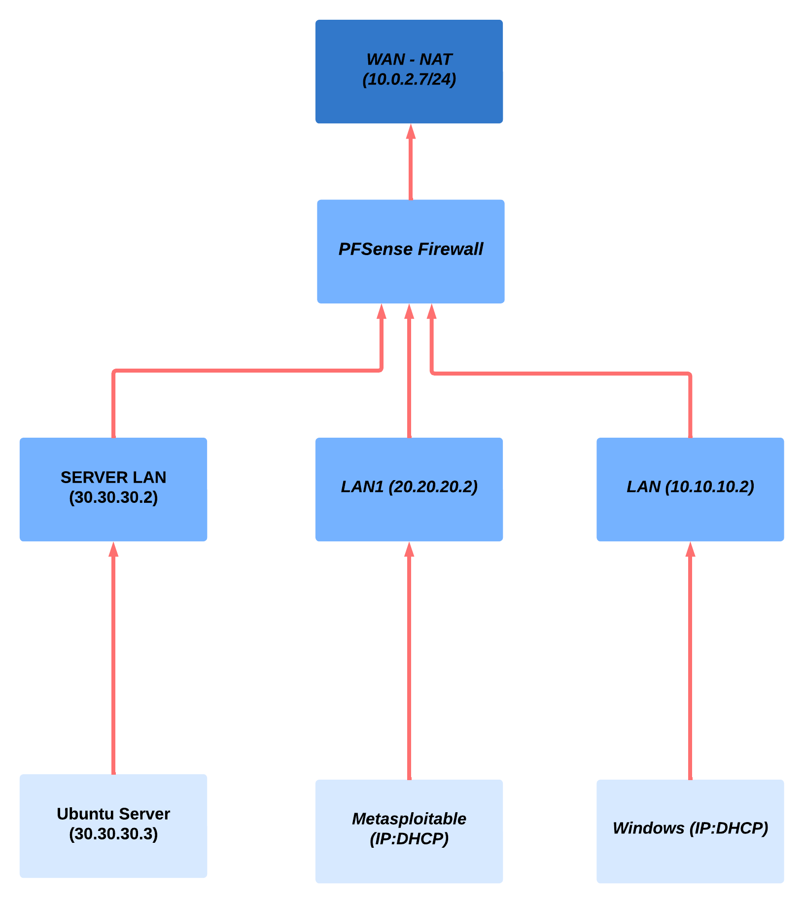

<a name="readme-top"></a>

[![Contributors][contributors-shield]][contributors-url]
[![Forks][forks-shield]][forks-url]
[![Stargazers][stars-shield]][stars-url]
[![Issues][issues-shield]][issues-url]
[![MIT License][license-shield]][license-url]
[![LinkedIn][linkedin-shield]][linkedin-url]

<!-- PROJECT LOGO -->
<br />
<div align="center">
  <a href="https://github.com/alperrkilic/DHCP-FTP-Server-with-PFSense">
    
  </a>

  <h3 align="center">How to set up a DHCP Server with PFSense</h3>

  <p align="center">
    A Simple Network Project 
    <br />
    <a href="https://github.com/alperrkilic/DHCP-FTP-Server-with-PFSense"><strong>Explore the docs »</strong></a>
    <br />
    <br />
    <a href="https://github.com/alperrkilic/DHCP-FTP-Server-with-PFSense">View Demo</a>
    ·
    <a href="https://github.com/alperrkilic/DHCP-FTP-Server-with-PFSense/issues">Report Bug</a>
    ·
    <a href="https://github.com/alperrkilic/DHCP-FTP-Server-with-PFSense/issues">Request Feature</a>
  </p>
</div>


<!-- TABLE OF CONTENTS -->
<details>
  <summary>Table of Contents</summary>
  <ol>
    <li>
      <a href="#about-the-project">About The Project</a>
      <ul>
        <li><a href="#built-with">Built With</a></li>
      </ul>
    </li>
    <li>
      <a href="#getting-started">Getting Started</a>
      <ul>
        <li><a href="#prerequisites">Prerequisites</a></li>
        <li><a href="#installation">Installation</a></li>
      </ul>
    </li>
    <li>
      <a href="#terminology">Terminology</a>
      <ul>
              <li><a href="#network">Network</a></li>
              <li><a href="#lan-and-subnet">Lan & Subnet</a></li>
              <li><a href="#dns">DNS</a></li>
              <li><a href="#http">HTTP</a></li>
              <li>
                <a href="#static-ip">IP & Static IP</a>
                <ul>
                  <li><a href="#metasploitable-static-ip-configuration">Metasploitable Static IP Configuration</a></li>
                  <li><a href="#windows-static-ip-configuration">Windows Static IP Configuration</a></li>
                  <li><a href="#ubuntu-server-static-ip-configuration">Ubuntu Server Static IP Configuration</a></li>
                </ul>
              </li>
              <li><a href="#broadcasting">Broadcasting</a></li>
              <li><a href="#dhcp">DHCP</a></li>        
              <li><a href="#router">Router</a></li>
              <li><a href="#switch">Switch</a></li>
              <li><a href="#gateway">Gateway</a></li>  
              <li><a href="#ftp">FTP</a></li>
              <li><a href="#tcp-handshake">TCP Handshake</a></li>    
      </ul>
    </li>
    <li>
      <a href="#setting-up">Setting Up</a>
    </li>
    <!-- <li><a href="#contributing">Contributing</a></li> -->
    <li><a href="#license">License</a></li>
    <li><a href="#contact">Contact</a></li>
    <li><a href="#acknowledgments">Acknowledgments</a></li>
  </ol>
</details>


<!-- ABOUT THE PROJECT -->
## About The Project

<div align="center">
    <a href="https://github.com/alperrkilic/DHCP-FTP-Server-with-PFSense">
      
    </a>
</div>


The DHCP Server for Ubuntu with PFsense Firewall is a project designed to provide efficient and reliable dynamic IP address allocation within your network infrastructure. This system combines the power and flexibility of Ubuntu Server, a widely used Linux distribution, with the robust security features of PFsense, a popular open-source firewall.


The primary purpose of this project is to simplify the management and distribution of IP addresses within your network. The Dynamic Host Configuration Protocol (DHCP) server automates the process of assigning IP addresses, subnet masks, default gateways, and other network configuration parameters to devices connected to your network. By automating this process, it eliminates the need for manual configuration on each individual device, saving time and reducing the potential for human error.

<p align="right">(<a href="#readme-top">back to top</a>)</p>


### Built With

This project was built using the following components:

* [![ubuntu][ubuntu]][ubuntu-url]
* [![windows][windows]][windows-url]
* [![linux][linux]][linux-url]
* [![pfsense][pfsense]][pfsense-url]
* [![metasploitable][metasploitable]][metasploitable-url]
* [![virtualbox][virtualbox]][virtualbox-url]


<p align="right">(<a href="#readme-top">back to top</a>)</p>


<!-- GETTING STARTED -->
## Getting Started

The DHCP server setup in this project includes the configuration of three separate LANs. Within one of these LANs, an IP block of 30.30.30.2 is allocated, the Ubuntu Server acts as the DHCP server, and a static IP address of 30.30.30.3 is assigned. PFsense firewall runs on IP address 10.10.10.2.

The purpose of this setup is to enable Ubuntu Server to distribute IP addresses from 30.30.30.3 range to devices connected to other LANs. With the implementation of this DHCP server solution, IP address allocation becomes automatic, eliminating the need for manual configuration on each device.

It is important to note that with this DHCP server setup, broadcasting from one LAN to another is not directly possible. A DHCP relay agent is used to facilitate the distribution of IP addresses over multiple LANs.

A DHCP relay agent, also known as a DHCP helper, is configured on routers or layer 3 switches that connect LANs. This agent receives DHCP broadcast messages from devices on a LAN and forwards them to the DHCP server located on Ubuntu Server's LAN (30.30.30.3). The DHCP server then responds with the appropriate IP address assignments, and the relay agent forwards these responses back to the requesting devices on their LANs.


### Prerequisites

To install the required files for the DHCP server and FTP, please enter the following commands into your terminal in Ubuntu-server: 
* pip
  ```sh
  sudo apt-get install isc-dhcp-server
  ```
  ```sh
  sudo apt-get install vsftpd
  ```


### Installation

_Setting up the DHCP Server and FTP on Ubuntu Server requires downloads and installations._

1. Download VirtualBox
2. Download Ubuntu Server from the link below
   ```sh
   https://ubuntu.com/server
   ```
3. Download Windows10 for VirtualBox
   ```sh
   https://drive.google.com/file/d/1YKnn1bzbC_34oEX91Vxj5BB1GdmWW3tP
   ```
   _Note: Windows10 image is not provided anymore by Microsoft, you can download it from the link above._

4. Download PFSense for VirtualBox
   ```sh
    https://www.pfsense.org/download/
   ```

5. Download Metasploitable for VirtualBox
   ```sh
    https://sourceforge.net/projects/metasploitable/
   ```

6. Configure the RAM and GPU for the virtual machines.
   ```js
   That's it! You're now ready to start setting up your DHCP server.
   ```

  _Note: For Windows, you must give at least 2 GB of RAM for it to work properly._

<p align="right">(<a href="#readme-top">back to top</a>)</p>


<!-- Terminology -->

## Terminology

Before we begin the setup of our DHCP and FTP server, we need to understand some terms.

### Network

A network consists of two or more computers connected together to share resources (such as printers and CDs), exchange files, or allow electronic communication. Computers in a network can be connected via cables, telephone lines, radio waves, satellites, or infrared light beams.

### LAN and Subnet

LAN (Local Area Network) refers to a group of devices connected within a specific physical location or network segment. It usually represents a single network infrastructure that allows devices to communicate directly with each other.

A subnet (subnet), on the other hand, is the division of a larger network into smaller logical networks. It enables better organization and management of IP addresses by grouping devices based on network requirements, security policies, or other factors.

Without proper routing between subnets, devices on one subnet cannot communicate directly with devices on the other subnet.

In our project 10.10.10.0/24 , 20.20.20.0/24 and 30.30.30.0/24 
are the subnets of our LAN.


### DNS

A Domain Name System (DNS) turns domain names into IP addresses that allow browsers to access websites and other internet resources. Every device on the Internet has an IP address that other devices can use to locate the device. Rather than memorizing a long list of IP addresses, people can simply enter the website name and DNS will get the IP address for them.

### HTTP

Hypertext Transfer Protocol (HTTP) is the foundation of the World Wide Web and is used to load web pages using hypertext links. HTTP is an application layer protocol designed to transfer information between networked devices and runs on top of other layers of the network protocol stack. A typical flow over HTTP involves a client machine making a request to a server and the server then sending a response message.
### Static IP

IP address means internet protocol address; An identifying number associated with a particular computer or computer network. When connected to the Internet, the IP address allows computers to send and receive information. Every device has its own unique IP address. In this project we will use IPv4 which is the 32 bit IP address.

There are four different types of IP addresses: public, private, static, and dynamic. Public and private indicates the location of the network while static and dynamic indicates the permanency of the IP Address.

A static IP address is the one that is created manually and does not change over time. But, when establishing a network suppose you have 200 computers. You'd have to configure all the IP addresses, subnet-masks, and default gateway. And also these configurations differs from one operating system to another. Below you can see how static IP configurations are made on different operating systems.

<!-- 
    IDS:
     metasploitable-static-ip-configuration
     windows-static-ip-configuration
     ubuntu-server-static-ip-configuration
  -->
#### Metasploitable Static IP Configuration

[![metasploitable-static][metasploitable-static]](https://github.com/alperrkilic/DHCP-FTP-Server-with-PFSense)


#### Windows Static IP Configuration

_Control Panel -> Network and Internet -> Network and Sharing Center_

[![windows-static][windows-static]](https://github.com/alperrkilic/DHCP-FTP-Server-with-PFSense)

_Note that default gateway should be PFSense in our case since we are using firewall (in our case 10.10.10.2)_

[![windows-static][windows-static-2]](https://github.com/alperrkilic/DHCP-FTP-Server-with-PFSense)


#### Ubuntu Server Static IP Configuration

_/etc/netplan/00-installer-config.yaml_

[![ubuntu-server-static][ubuntu-server-static]](https://github.com/alperrkilic/DHCP-FTP-Server-with-PFSense)

### Broadcasting

Broadcasting is a type of group communication in which a sender provides data to multiple receivers at the same time. This is a communication model where each sending device sends data to all other devices in the network area.

When your computer first connects to a Local Area Network (LAN), it does not have an IP address. It must connect to a Dynamic Host Configuration Protocol (DHCP) server to obtain an IP address. To do this, your computer must perform a broadcast to a private Broadcast IP address of 255.255.255.255; this essentially means that every machine on the LAN will receive your request for an IP address. The DHCP server will respond with an IP address to be assigned to your machine.

In our case we will specify the broadcast address of LAN's as 10.10.10.255, 20.20.20.255, 30.30.30.255 meaning that the machines on these subnets will broadcast for IP address


_Metasploitable machine Broadcasting for getting IP_

[![before-getting-ip][before-getting-ip]](https://github.com/alperrkilic/DHCP-FTP-Server-with-PFSense)

_Refreshing networking service to get IP_

   ```sh
    /etc/init.d/networking restart
   ```


[![getting-ip][getting-ip]](https://github.com/alperrkilic/DHCP-FTP-Server-with-PFSense)

_Metasploitable machine after getting its IP from DHCP Server_

[![after-getting-ip][after-getting-ip]](https://github.com/alperrkilic/DHCP-FTP-Server-with-PFSense)

### DHCP

Dynamic Host Configuration Protocol (DHCP) is a network protocol used to automate the process of configuring devices on IP networks. In this project, we will use DHCP relay on PFSense Firewall since broadcasting is done only within the subnet, we have to indicate the server machine as distributor so that the other machines can get their IP's.

[![dhcp_server_running][dhcp_server_running]](https://github.com/alperrkilic/DHCP-FTP-Server-with-PFSense)


### Router

A router is a device that connects two or more packet switched networks or subnets. Layer 3 switch's can also act as routers.

One of the primary jobs of a router is to assign IP addresses to the computers on a home network. The router has a “pool” of IP addresses that it keeps track of. When a computer connects to it and asks for an IP address, the router picks an IP address from the pool and assigns it to the computer. The router makes sure that two computers are not assigned the same IP address. This process of computers asking for an IP address from the router is called “dynamic” IP address assignment. It uses a network protocol called DHCP (Dynamic Host Configuration Protocol).


[![router][router]](https://github.com/alperrkilic/DHCP-FTP-Server-with-PFSense)


### Switch

A network switch is a physical device that operates at the Data Link layer -- Layer 2 of the Open Systems Interconnect (OSI) model. It receives packets sent by devices connected to physical ports and forwards them to devices. intended to reach the packets. Switches can also operate at the Network Layer (Layer 3) where routing occurs. In summary, the switch forwards packets to the devices that the packets are intended to send and connects the local devices with the router.

[![switch_vs_router][switch_vs_router]](https://github.com/alperrkilic/DHCP-FTP-Server-with-PFSense)


_Difference between switch and router._

### Gateway

A gateway is a node in a computer network that provides an important stopping point for data to or from other networks. In this project, gateways are 10.10.10.2, 20.20.20.2, and 30.30.30.2 which are the IP's of the LAN networks.

If we compare the router and the gateway in simple terms, a router is a type of gateway that focuses specifically on routing network traffic. However, the Gateway can also refer to other types of devices that act as entry points between networks, such as firewall gateways or proxy servers.

[![gateway][gateway]](https://github.com/alperrkilic/DHCP-FTP-Server-with-PFSense)

### FTP

The term file transfer protocol (FTP) refers to a process that involves transferring files between devices over a network. The process works when one party allows the other to send or receive files over the Internet. In our project, Ubuntu Server (30.30.30.3) will be our FTP server where we upload or download files

[![ftp][ftp]](https://github.com/alperrkilic/DHCP-FTP-Server-with-PFSense)

_Connecting via FTP to Ubuntu Server_

[![ftp_send][ftp_send]](https://github.com/alperrkilic/DHCP-FTP-Server-with-PFSense)

_Sending file through FTP_


### TCP Handshake

The Three-Way Handshake or TCP 3-way handshake is a process used to establish a connection between a server and a client in a TCP/IP network. It is a three-step process that requires both the client and server to exchange synchronization and acknowledgment packets before the actual data communication process begins.


[![tcp_handshake][tcp_handshake]](https://github.com/alperrkilic/DHCP-FTP-Server-with-PFSense)


_TCP Handshake Scheme_

<!-- Setting Up -->
## Setting Up

After downloading all our virtual machines, we can now start setting up your DHCP server. The first thing we can do is connect the adapters. we will connect 3 Host-only adapters and one NAT network. 

[![virtual-adapters][virtual-adapters]](https://github.com/alperrkilic/DHCP-FTP-Server-with-PFSense)

_Virtual Adapters IP's 10.10.10.1, 20.20.20.1, 30.30.30.1_

[![pfsense-vbox][pfsense-vbox]](https://github.com/alperrkilic/DHCP-FTP-Server-with-PFSense)

_Adapters that are connected to PFSense Virtual Machine_

[![windows-vbox][windows-vbox]](https://github.com/alperrkilic/DHCP-FTP-Server-with-PFSense)

_Adapter 2 is connected to windows which has the IP of 10.10.10.1_

[![metasploitable-vbox][metasploitable-vbox]](https://github.com/alperrkilic/DHCP-FTP-Server-with-PFSense)

_Adapter 3 is connected to Metasploitable Machine which has the IP of 20.20.20.1_

[![ubuntu-server-vbox][ubuntu-server-vbox]](https://github.com/alperrkilic/DHCP-FTP-Server-with-PFSense)

_Adapter 4 is connected to Ubuntu Server Machine which has the IP of 30.30.30.1 , this will be our DHCP server_

Now we need to configure the LAN interface on our PFSense machine, we have to set it to 10.10.10.2 because the adapter has 10.10.10.1


[![pfsense_machine][pfsense_machine]](https://github.com/alperrkilic/DHCP-FTP-Server-with-PFSense)

_You can see the LAN interface as 10.10.10.2 the other LAN1 and SERVER is not configured yet_

In order to access to PFSense interface on Web browser, now we can assign windows IP as 10.10.10.5 (5 can be different) and give default gateway as 10.10.10.2 to connect firewall. Note that subnet-mask must be 255.255.255.0 since the first 24 bits will remain constant

[![interfaces][interfaces]](https://github.com/alperrkilic/DHCP-FTP-Server-with-PFSense)

After opening 10.10.10.2 and connecting to our PFSense, (assuming you have completed the sign up operations) now we will add new interfaces for our other LAN's which are going to be 20.20.20.2 and 30.30.30.2 (LAN1 -> 20.20.20.2 , SERVER -> 30.30.30.2)

[![interfaces-2][interfaces-2]](https://github.com/alperrkilic/DHCP-FTP-Server-with-PFSense)

_After setting up these LAN's you should see them running_

After that you can write Rules to determine which packages will be allowed between these subnets.

[![writing_policy][writing_policy]](https://github.com/alperrkilic/DHCP-FTP-Server-with-PFSense)

_For every LAN you will specify the source and destination if you want to allow every package just make the source as the interface name and destination any -> source: LAN1 net, destination: any_

[![ping_ubuntu][ping_ubuntu]](https://github.com/alperrkilic/DHCP-FTP-Server-with-PFSense)

_After writing policy check whether you can ping other LAN's or not since on default options you cannot ping another subnet, in this example 30.30.30.3, from 20.20.20.0/24 subnet_


[![ubuntu-server-static][ubuntu-server-static]](https://github.com/alperrkilic/DHCP-FTP-Server-with-PFSense)

_Configure Ubuntu Server's IP as static and give it 30.30.30.3 since 30.30.30.1 is adapter and 30.30.30.2 is the SERVER. To configure it's static ip refer to:_ 

<p align="right"><a href="#ubuntu-server-static-ip-configuration">Ubuntu Server Static IP Configuration</a></p>

[![ubuntu_ifconfig][ubuntu_ifconfig]](https://github.com/alperrkilic/DHCP-FTP-Server-with-PFSense)

_After setting it's static IP check whether it'is set correctly, above is set correctly_

At this point we can start configurating our DHCP server at Ubuntu Server. Refer to Prerequisites to download DHCP server and FTP server at the same time. FTP won't be explained detailed since it's not that hard to set it up

<p align="right"><a href="#prerequisites">Prerequisites</a></p>


Now with your text editor open /etc/dhcp/dhcpd.conf (I am using nano)

[![dhcpd.conf][dhcpd.conf]](https://github.com/alperrkilic/DHCP-FTP-Server-with-PFSense)

_Here you will indicate the DHCP configurations for each subnet. you can determine range, subnet-mask, routers, broadcast-address._


[![isc-dhcp-server][isc-dhcp-server]](https://github.com/alperrkilic/DHCP-FTP-Server-with-PFSense)

_You should also write the name of the interface in /etc/default/isc-dhcp-server (enp0s3 in this case)_

After these steps you should see your DHCP server as active and running after restarting it. You can see it with typing these commands into terminal

   ```sh
    systemctl restart isc-dhcp-server
   ```
   ```sh
    systemctl status isc-dhcp-server
   ```

[![dhcp-server-running][dhcp-server-running]](https://github.com/alperrkilic/DHCP-FTP-Server-with-PFSense)

_If not working it will seem as this:_

[![dhcp-server-not-running][dhcp-server-not-running]](https://github.com/alperrkilic/DHCP-FTP-Server-with-PFSense)

_If there's a syntax error etc. in your dhcpd.conf file you can use this command and debug it:_

   ```sh
    journalctl -xe
   ```

Lastly you have to ensure that you are using DHCP Relay since broadcasting is done within a subnet, you can not directly use DHCP to do that, from your windows open Firewall interface and configure it as below. Make sure you've checked the enable box

[![dhcp-relay][dhcp-relay]](https://github.com/alperrkilic/DHCP-FTP-Server-with-PFSense)

_With this configurations, your DHCP server is set up now check whether a machine gets its IP dynamically while both Ubuntu Server and PFSense is running_

[![before-getting-ip][before-getting-ip]](https://github.com/alperrkilic/DHCP-FTP-Server-with-PFSense)

_Before getting IP_

[![getting-ip][getting-ip]](https://github.com/alperrkilic/DHCP-FTP-Server-with-PFSense)

_Restarting network to get the IP_

[![after-getting-ip][after-getting-ip]](https://github.com/alperrkilic/DHCP-FTP-Server-with-PFSense)

_After getting IP_

And also now you can use your Ubuntu Server as Cloud and you can upload and download files via FTP and determine which LAN's will have access to this FTP server via Firewall

[![ftp-interface][ftp-interface]](https://github.com/alperrkilic/DHCP-FTP-Server-with-PFSense)

<p align="right">(<a href="#readme-top">back to top</a>)</p>


<!-- LICENSE -->
## License

Distributed under the MIT License. See `LICENSE.txt` for more information.

<p align="right">(<a href="#readme-top">back to top</a>)</p>


<!-- CONTACT -->
## Contact

Bayram Alper KILIÇ - [@alperrkilic](https://www.linkedin.com/in/bayram-alper-kilic/) - alperkilicbusiness@gmail.com

Project Link: [https://github.com/alperrkilic/DHCP-FTP-Server-with-PFSense](https://github.com/alperrkilic/DHCP-FTP-Server-with-PFSense)

<p align="right">(<a href="#readme-top">back to top</a>)</p>


<!-- ACKNOWLEDGMENTS -->
## Acknowledgments

Here are some references I used to gather information and set up my DHCP server.

* [Network](https://fcit.usf.edu/network/chap1/chap1.htm)
* [DNS](https://www.fortinet.com/resources/cyberglossary/what-is-dns#:~:text=What%20is%20DNS%3F,use%20to%20locate%20the%20device.)
* [HTTP](https://www.cloudflare.com/learning/ddos/glossary/hypertext-transfer-protocol-http/)
* [IP](https://www.investopedia.com/terms/i/ip-address.asp)
* [DHCP](https://efficientip.com/glossary/what-is-dhcp-and-why-is-it-important/)
* [Router-1](https://www.cloudflare.com/learning/network-layer/what-is-a-router/)
* [Router-2](https://www.lmi.net/support/common/dsl-support/ip-addresses/#:~:text=One%20of%20the%20primary%20jobs,assigns%20it%20to%20the%20computer.)
* [Switch](https://www.lifewire.com/difference-between-router-and-switch-5207135#:~:text=Switches%20expand%20and%20optimize%20a,are%20connected%20to%20the%20switch.)
* [Gateway](https://whatismyipaddress.com/gateway)
* [FTP](https://www.investopedia.com/terms/f/ftp-file-transfer-protocol.asp)
* [Restarting Network](https://www.layerstack.com/resources/tutorials/How-to-restart-Network-Interface-or-Network-Adapter-on-Linux-and-Windows-Cloud-Servers)
* [FTP Set Up](https://www.hostinger.com/tutorials/how-to-setup-ftp-server-on-ubuntu-vps/)
* [Choose an Open Source License](https://choosealicense.com)
* [Img Shields](https://shields.io)


<p align="right">(<a href="#readme-top">back to top</a>)</p>


<!-- Shields & URLS -->

[contributors-shield]: https://img.shields.io/github/contributors/alperrkilic/DHCP-FTP-Server-with-PFSense.svg?style=for-the-badge
[contributors-url]: https://github.com/alperrkilic/DHCP-FTP-Server-with-PFSense/graphs/contributors
[forks-shield]: https://img.shields.io/github/forks/alperrkilic/DHCP-FTP-Server-with-PFSense.svg?style=for-the-badge
[forks-url]: https://github.com/alperrkilic/DHCP-FTP-Server-with-PFSense/network/members
[stars-shield]: https://img.shields.io/github/stars/alperrkilic/DHCP-FTP-Server-with-PFSense.svg?style=for-the-badge
[stars-url]: https://github.com/alperrkilic/DHCP-FTP-Server-with-PFSense/stargazers
[issues-shield]: https://img.shields.io/github/issues/alperrkilic/DHCP-FTP-Server-with-PFSense.svg?style=for-the-badge
[issues-url]: https://github.com/alperrkilic/DHCP-FTP-Server-with-PFSense/issues
[license-shield]: https://img.shields.io/github/license/alperrkilic/DHCP-FTP-Server-with-PFSense.svg?style=for-the-badge
[license-url]: https://github.com/alperrkilic/DHCP-FTP-Server-with-PFSense/blob/master/LICENSE.txt

<!-- Built with Section -->
[linkedin-shield]: https://img.shields.io/badge/-LinkedIn-black.svg?style=for-the-badge&logo=linkedin&colorB=555
[linkedin-url]: https://www.linkedin.com/in/bayram-alper-kilic/
[ubuntu]: https://img.shields.io/badge/Ubuntu-E95420?style=for-the-badge&logo=ubuntu&logoColor=white
[ubuntu-url]: https://ubuntu.com/
[windows]: https://img.shields.io/badge/Windows-0078D6?style=for-the-badge&logo=windows&logoColor=white
[windows-url]: https://www.microsoft.com
[linux]: https://img.shields.io/badge/Linux-FCC624?style=for-the-badge&logo=linux&logoColor=black
[linux-url]: https://www.linux.org/
[pfsense]: https://img.shields.io/badge/PFSense-000000?style=for-the-badge&logo=pfsense&logoColor=white
[pfsense-url]: https://www.pfsense.org/
[metasploitable]: https://img.shields.io/badge/Metasploitable-000000?style=for-the-badge&logo=metasploitable&logoColor=white
[metasploitable-url]: https://docs.rapid7.com/metasploit/metasploitable-2-exploitability-guide/
[virtualbox]: https://img.shields.io/badge/VirtualBox-00000?style=for-the-badge&logo=virtualbox&logoColor=white&color=blue
[virtualbox-url]: https://www.virtualbox.org/

<!-- Terminology Section -->
<!-- Static IP -->
[metasploitable-static]: readme-images/Static-IP/metasploitable_static_ip.png
[windows-static]: readme-images/Static-IP/windows_static_ip_1.png
[windows-static-2]: readme-images/Static-IP/windows_static_ip_2.png
[ubuntu-server-static]: readme-images/Static-IP/ubuntu-server-static-ip.png
<!-- Broadcasting -->
[before-getting-ip]: readme-images/DHCP/Working/before_getting_ip.png
[getting-ip]: readme-images/DHCP/Working/getting_ip.png
[after-getting-ip]: readme-images/DHCP/Working/after_getting_ip.png
<!-- DHCP -->
[dhcp_server_running]: readme-images/DHCP/Working/dhcp_server_running.png
<!-- Router -->
[router]: readme-images/Terminology/router.png
<!-- Switch -->
[switch_vs_router]: readme-images/Terminology/switch_vs_router.png
<!-- Gateway -->
[gateway]: readme-images/Terminology/gateway.jpg
<!-- FTP -->
[ftp]: readme-images/FTP/connect_via_ftp.png
[ftp_send]: readme-images/FTP/ftp_send.png
<!-- TCP Handshake -->
[tcp_handshake]: readme-images/Terminology/tcp_handshake.png

<!-- Setting Up -->
[product-screenshot]: readme-images/Diagram.png
[pfsense-vbox]: readme-images/DHCP/VirtualBox/PFSense_connected_adapters.png
[metasploitable-vbox]: readme-images/DHCP/VirtualBox/metasploitable_adapter.png
[ubuntu-server-vbox]: readme-images/DHCP/VirtualBox/ubuntu_server_adapter.png
[windows-vbox]: readme-images/DHCP/VirtualBox/windows_adapter.png
[virtual-adapters]: readme-images/DHCP/VirtualBox/virtual-adapters.png
[pfsense_machine]: readme-images/DHCP/Working/PFSense.png
[dhcp_relay]: readme-images/DHCP/PFSense/dhcp_relay.png
[interfaces]: readme-images/DHCP/PFSense/interfaces.png
[interfaces-2]: readme-images/DHCP/PFSense/interfaces-2.png
[writing_policy]: readme-images/DHCP/PFSense/writing_policy.png
[ping_ubuntu]: readme-images/DHCP/Working/ping_ubuntu.png
[ubuntu_ifconfig]: readme-images/DHCP/Working/ubuntu-server.png
[dhcpd.conf]: readme-images/DHCP/Working/dhcpd.conf.png
[isc-dhcp-server]: readme-images/DHCP/Working/isc-dhcp-server.png
[dhcp-server-running]: readme-images/DHCP/Working/dhcp_server_running.png
[dhcp-server-not-running]: readme-images/DHCP/Not-working/dhcp-status.png
[dhcp-relay]: readme-images/DHCP/PFSense/dhcp_relay.png
[ftp-interface]: readme-images/FTP/ftp_interface.png


